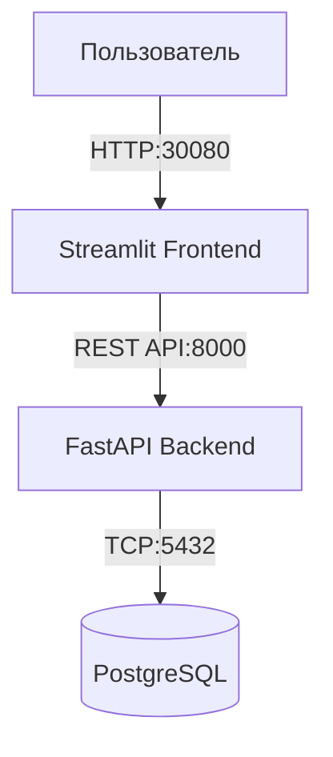

# Отчёт по лабораторной работе
## HR Portal — развёртывание многосервисного приложения в Kubernetes

**Вариант 3:** HR Portal (База сотрудников: ФИО, должность, отдел, зарплата, дата найма)

---


## Сценарий приложения

**HR Portal** — веб-приложение для управления базой сотрудников.

**Функциональность:**
- Просмотр списка сотрудников с фильтром по отделу и поиском по ФИО
- Добавление новых сотрудников
- Редактирование и удаление существующих записей
- Статистика: количество сотрудников и средняя зарплата по отделам, распределение зарплат по должностям

**Технологический стек:**
- **База данных:** PostgreSQL 15
- **Backend:** FastAPI (Python)
- **Frontend:** Streamlit (Python)
- **Оркестрация:** Kubernetes (MicroK8s)

**Архитектура проекта:**

---

## Структура проекта
```
lab_04.1/
├── src/
│   ├── backend/
│   │   ├── main.py          # FastAPI приложение
│   │   ├── seed.py          # Генерация 10 000 сотрудников
│   │   ├── requirements.txt
│   │   └── Dockerfile
│   └── frontend/
│       ├── app.py           # Streamlit интерфейс
│       ├── requirements.txt
│       └── Dockerfile
├── k8s/
│   └── fullstack.yaml       # Манифесты Kubernetes
└── lab_04.md               
```

---

## Этап 2. Разработка бэкенда (FastAPI)

### 2.1. Создание файла `src/backend/requirements.txt`

```txt
fastapi
uvicorn
psycopg2-binary
sqlalchemy
pydantic
```

### 2.2. Создание файла src/backend/main.py

```
import os
import time
from fastapi import FastAPI, HTTPException, Query
from fastapi.middleware.cors import CORSMiddleware
from pydantic import BaseModel
from sqlalchemy import create_engine, Column, Integer, String, Float, Date, func
from sqlalchemy.ext.declarative import declarative_base
from sqlalchemy.orm import sessionmaker
from typing import Optional
import datetime

# Ожидание готовности PostgreSQL
time.sleep(7)

# Переменные окружения для подключения к БД
DB_USER = os.getenv("DB_USER", "hruser")
DB_PASSWORD = os.getenv("DB_PASSWORD", "hrpassword")
DB_HOST = os.getenv("DB_HOST", "postgres-service")
DB_NAME = os.getenv("DB_NAME", "hr_db")

DATABASE_URL = f"postgresql://{DB_USER}:{DB_PASSWORD}@{DB_HOST}/{DB_NAME}"

engine = create_engine(DATABASE_URL)
SessionLocal = sessionmaker(autocommit=False, autoflush=False, bind=engine)
Base = declarative_base()

# Модель данных
class Employee(Base):
    __tablename__ = "employees"
    id = Column(Integer, primary_key=True, index=True)
    full_name = Column(String, index=True)
    position = Column(String)
    department = Column(String)
    salary = Column(Float)
    hire_date = Column(Date)

Base.metadata.create_all(bind=engine)

app = FastAPI(title="HR Portal API")

# CORS для фронтенда
app.add_middleware(
    CORSMiddleware,
    allow_origins=["*"],
    allow_methods=["*"],
    allow_headers=["*"],
)

# Pydantic модели
class EmployeeCreate(BaseModel):
    full_name: str
    position: str
    department: str
    salary: float
    hire_date: datetime.date

class EmployeeUpdate(BaseModel):
    full_name: Optional[str] = None
    position: Optional[str] = None
    department: Optional[str] = None
    salary: Optional[float] = None
    hire_date: Optional[datetime.date] = None

# ---------------------- Эндпоинты ----------------------

@app.get("/employees")
def get_employees(
    skip: int = 0,
    limit: int = 50,
    department: Optional[str] = None,
    search: Optional[str] = None,
):
    db = SessionLocal()
    query = db.query(Employee)
    if department:
        query = query.filter(Employee.department == department)
    if search:
        query = query.filter(Employee.full_name.ilike(f"%{search}%"))
    total = query.count()
    employees = query.offset(skip).limit(limit).all()
    db.close()
    return {"total": total, "items": employees}

@app.get("/employees/{employee_id}")
def get_employee(employee_id: int):
    db = SessionLocal()
    emp = db.query(Employee).filter(Employee.id == employee_id).first()
    db.close()
    if not emp:
        raise HTTPException(status_code=404, detail="Employee not found")
    return emp

@app.post("/employees")
def create_employee(emp: EmployeeCreate):
    db = SessionLocal()
    new_emp = Employee(**emp.dict())
    db.add(new_emp)
    db.commit()
    db.refresh(new_emp)
    db.close()
    return new_emp

@app.put("/employees/{employee_id}")
def update_employee(employee_id: int, emp: EmployeeUpdate):
    db = SessionLocal()
    existing = db.query(Employee).filter(Employee.id == employee_id).first()
    if not existing:
        db.close()
        raise HTTPException(status_code=404, detail="Employee not found")
    for field, value in emp.dict(exclude_none=True).items():
        setattr(existing, field, value)
    db.commit()
    db.refresh(existing)
    db.close()
    return existing

@app.delete("/employees/{employee_id}")
def delete_employee(employee_id: int):
    db = SessionLocal()
    existing = db.query(Employee).filter(Employee.id == employee_id).first()
    if not existing:
        db.close()
        raise HTTPException(status_code=404, detail="Employee not found")
    db.delete(existing)
    db.commit()
    db.close()
    return {"detail": "Deleted"}

@app.get("/departments")
def get_departments():
    db = SessionLocal()
    departments = db.query(Employee.department).distinct().all()
    db.close()
    return [d[0] for d in departments]

@app.get("/stats/by-department")
def stats_by_department():
    db = SessionLocal()
    result = (
        db.query(
            Employee.department,
            func.count(Employee.id).label("count"),
            func.avg(Employee.salary).label("avg_salary"),
        )
        .group_by(Employee.department)
        .all()
    )
    db.close()
    return [
        {"department": r.department, "count": r.count, "avg_salary": round(r.avg_salary, 2)}
        for r in result
    ]

@app.get("/stats/salary-distribution")
def salary_distribution():
    db = SessionLocal()
    result = (
        db.query(Employee.position, func.avg(Employee.salary).label("avg_salary"))
        .group_by(Employee.position)
        .order_by(func.avg(Employee.salary).desc())
        .limit(15)
        .all()
    )
    db.close()
    return [{"position": r.position, "avg_salary": round(r.avg_salary, 2)} for r in result]

@app.get("/health")
def health():
    return {"status": "ok"}
```

### 2.3. Создание файла src/backend/Dockerfile
```
FROM python:3.9-slim
WORKDIR /app
COPY requirements.txt .
RUN pip install --no-cache-dir -r requirements.txt
COPY . .
CMD ["uvicorn", "main:app", "--host", "0.0.0.0", "--port", "8000"]
```

## Этап 3. Разработка фронтенда (Streamlit)

### 3.1. Создание файла src/frontend/requirements.txt
```
streamlit
requests
pandas
```

### 3.2. Создание файла src/frontend/app.py

```
import streamlit as st
import requests
import pandas as pd
import os
import datetime

BACKEND_URL = os.getenv("BACKEND_URL", "http://backend-service:8000")

st.set_page_config(page_title="HR Portal", page_icon="👥", layout="wide")
st.title("👥 HR Portal — База сотрудников")

def get_departments():
    try:
        res = requests.get(f"{BACKEND_URL}/departments", timeout=5)
        return res.json() if res.status_code == 200 else []
    except Exception:
        return []

def get_employees(skip=0, limit=50, department=None, search=None):
    try:
        params = {"skip": skip, "limit": limit}
        if department:
            params["department"] = department
        if search:
            params["search"] = search
        res = requests.get(f"{BACKEND_URL}/employees", params=params, timeout=5)
        return res.json() if res.status_code == 200 else {"total": 0, "items": []}
    except Exception as e:
        st.error(f"Ошибка подключения к бэкенду: {e}")
        return {"total": 0, "items": []}

tab_list, tab_add, tab_edit, tab_stats = st.tabs(
    ["📋 Список сотрудников", "➕ Добавить", "✏️ Редактировать / Удалить", "📊 Статистика"]
)

# ---------------------- Вкладка "Список сотрудников" ----------------------
with tab_list:
    st.subheader("Список сотрудников")
    col1, col2, col3 = st.columns([2, 2, 1])
    with col1:
        search_query = st.text_input("🔍 Поиск по ФИО", "")
    with col2:
        departments = ["Все"] + get_departments()
        selected_dept = st.selectbox("Отдел", departments)
    with col3:
        page_size = st.selectbox("Записей на странице", [25, 50, 100], index=1)

    dept_filter = None if selected_dept == "Все" else selected_dept

    if "list_page" not in st.session_state:
        st.session_state.list_page = 0

    data = get_employees(
        skip=st.session_state.list_page * page_size,
        limit=page_size,
        department=dept_filter,
        search=search_query if search_query else None,
    )
    total = data.get("total", 0)
    items = data.get("items", [])
    st.caption(f"Найдено сотрудников: **{total}**")

    if items:
        df = pd.DataFrame(items)
        df = df.rename(columns={
            "id": "ID",
            "full_name": "ФИО",
            "position": "Должность",
            "department": "Отдел",
            "salary": "Зарплата (₽)",
            "hire_date": "Дата найма",
        })
        df["Зарплата (₽)"] = df["Зарплата (₽)"].apply(lambda x: f"{x:,.0f}".replace(",", " "))
        st.dataframe(df[["ID", "ФИО", "Должность", "Отдел", "Зарплата (₽)", "Дата найма"]], use_container_width=True)

        total_pages = (total - 1) // page_size
        col_prev, col_info, col_next = st.columns([1, 3, 1])
        with col_prev:
            if st.button("← Назад") and st.session_state.list_page > 0:
                st.session_state.list_page -= 1
                st.rerun()
        with col_info:
            st.write(f"Страница {st.session_state.list_page + 1} из {total_pages + 1}")
        with col_next:
            if st.button("Вперёд →") and st.session_state.list_page < total_pages:
                st.session_state.list_page += 1
                st.rerun()
    else:
        st.info("Нет данных")

# ---------------------- Вкладка "Добавить" ----------------------
with tab_add:
    st.subheader("Добавить нового сотрудника")
    with st.form("add_form", clear_on_submit=True):
        full_name = st.text_input("ФИО *")
        position = st.text_input("Должность *")
        department = st.text_input("Отдел *")
        salary = st.number_input("Зарплата (₽)", min_value=0.0, step=1000.0, value=80000.0)
        hire_date = st.date_input("Дата найма", value=datetime.date.today())
        submitted = st.form_submit_button("Добавить")
        if submitted:
            if not full_name or not position or not department:
                st.warning("Заполните все обязательные поля (*).")
            else:
                try:
                    res = requests.post(
                        f"{BACKEND_URL}/employees",
                        json={
                            "full_name": full_name,
                            "position": position,
                            "department": department,
                            "salary": salary,
                            "hire_date": hire_date.isoformat(),
                        },
                        timeout=5,
                    )
                    if res.status_code == 200:
                        st.success("✅ Сотрудник добавлен!")
                    else:
                        st.error(f"Ошибка: {res.text}")
                except Exception as e:
                    st.error(f"Ошибка подключения: {e}")

# ---------------------- Вкладка "Редактировать / Удалить" ----------------------
with tab_edit:
    st.subheader("Редактировать или удалить сотрудника")
    emp_id_input = st.number_input("ID сотрудника", min_value=1, step=1, value=1)
    col_load, col_delete = st.columns([2, 1])
    with col_load:
        if st.button("Загрузить данные"):
            try:
                res = requests.get(f"{BACKEND_URL}/employees/{int(emp_id_input)}", timeout=5)
                if res.status_code == 200:
                    st.session_state.edit_data = res.json()
                else:
                    st.error("Сотрудник не найден.")
                    st.session_state.pop("edit_data", None)
            except Exception as e:
                st.error(f"Ошибка: {e}")
    with col_delete:
        if st.button("🗑️ Удалить", type="secondary"):
            try:
                res = requests.delete(f"{BACKEND_URL}/employees/{int(emp_id_input)}", timeout=5)
                if res.status_code == 200:
                    st.success("Сотрудник удалён.")
                    st.session_state.pop("edit_data", None)
                else:
                    st.error("Не удалось удалить.")
            except Exception as e:
                st.error(f"Ошибка: {e}")
    if "edit_data" in st.session_state:
        ed = st.session_state.edit_data
        with st.form("edit_form"):
            new_name = st.text_input("ФИО", value=ed.get("full_name", ""))
            new_position = st.text_input("Должность", value=ed.get("position", ""))
            new_department = st.text_input("Отдел", value=ed.get("department", ""))
            new_salary = st.number_input("Зарплата (₽)", value=float(ed.get("salary", 0)), step=1000.0)
            new_hire_date = st.date_input(
                "Дата найма",
                value=datetime.date.fromisoformat(ed["hire_date"]) if ed.get("hire_date") else datetime.date.today(),
            )
            save = st.form_submit_button("💾 Сохранить изменения")
            if save:
                try:
                    res = requests.put(
                        f"{BACKEND_URL}/employees/{ed['id']}",
                        json={
                            "full_name": new_name,
                            "position": new_position,
                            "department": new_department,
                            "salary": new_salary,
                            "hire_date": new_hire_date.isoformat(),
                        },
                        timeout=5,
                    )
                    if res.status_code == 200:
                        st.success("✅ Данные обновлены!")
                        st.session_state.edit_data = res.json()
                    else:
                        st.error(f"Ошибка: {res.text}")
                except Exception as e:
                    st.error(f"Ошибка: {e}")

# ---------------------- Вкладка "Статистика" ----------------------
with tab_stats:
    st.subheader("Статистика по сотрудникам")
    if st.button("Загрузить статистику"):
        try:
            r1 = requests.get(f"{BACKEND_URL}/stats/by-department", timeout=5)
            r2 = requests.get(f"{BACKEND_URL}/stats/salary-distribution", timeout=5)
            if r1.status_code == 200:
                dept_data = r1.json()
                df_dept = pd.DataFrame(dept_data)
                df_dept.columns = ["Отдел", "Кол-во сотрудников", "Средняя зарплата (₽)"]
                df_dept = df_dept.sort_values("Кол-во сотрудников", ascending=False)
                st.markdown("### Сотрудники по отделам")
                col1, col2 = st.columns(2)
                with col1:
                    st.dataframe(df_dept, use_container_width=True)
                with col2:
                    st.bar_chart(df_dept.set_index("Отдел")["Кол-во сотрудников"])
            if r2.status_code == 200:
                sal_data = r2.json()
                df_sal = pd.DataFrame(sal_data)
                df_sal.columns = ["Должность", "Средняя зарплата (₽)"]
                st.markdown("### Средняя зарплата по должностям (топ-15)")
                st.bar_chart(df_sal.set_index("Должность"))
        except Exception as e:
            st.error(f"Ошибка: {e}")
```

### 3.3. Создание файла src/frontend/Dockerfile
```
FROM python:3.9-slim
WORKDIR /app
COPY requirements.txt .
RUN pip install --no-cache-dir -r requirements.txt
COPY . .
EXPOSE 8501
CMD ["streamlit", "run", "app.py", "--server.port=8501", "--server.address=0.0.0.0"]
```

## Этап 4. Сборка Docker-образов

```
# Сборка образа бэкенда
docker build -t hr-backend:v1 ./src/backend

# Сборка образа фронтенда
docker build -t hr-frontend:v1 ./src/frontend
```


## Этап 5. Импорт образов в MicroK8s

```
docker save hr-backend:v1 | microk8s ctr image import -
docker save hr-frontend:v1 | microk8s ctr image import -
```


Проверка:

```
microk8s ctr images ls | grep hr-
```


## Этап 6. Манифесты Kubernetes. Файл k8s/fullstack.yaml:

```
apiVersion: apps/v1
kind: Deployment
metadata:
  name: postgres-deploy
spec:
  replicas: 1
  selector:
    matchLabels:
      app: postgres
  template:
    metadata:
      labels:
        app: postgres
    spec:
      containers:
      - name: postgres
        image: postgres:15
        env:
        - name: POSTGRES_USER
          value: "hruser"
        - name: POSTGRES_PASSWORD
          value: "hrpassword"
        - name: POSTGRES_DB
          value: "hr_db"
        ports:
        - containerPort: 5432
        volumeMounts:
        - name: pg-data
          mountPath: /var/lib/postgresql/data
      volumes:
      - name: pg-data
        emptyDir: {}
---
apiVersion: v1
kind: Service
metadata:
  name: postgres-service
spec:
  selector:
    app: postgres
  ports:
    - port: 5432
      targetPort: 5432
---
apiVersion: apps/v1
kind: Deployment
metadata:
  name: backend-deploy
spec:
  replicas: 1
  selector:
    matchLabels:
      app: backend
  template:
    metadata:
      labels:
        app: backend
    spec:
      containers:
      - name: backend
        image: hr-backend:v1
        imagePullPolicy: Never
        env:
        - name: DB_USER
          value: "hruser"
        - name: DB_PASSWORD
          value: "hrpassword"
        - name: DB_HOST
          value: "postgres-service"
        - name: DB_NAME
          value: "hr_db"
        ports:
        - containerPort: 8000
---
apiVersion: v1
kind: Service
metadata:
  name: backend-service
spec:
  selector:
    app: backend
  ports:
    - port: 8000
      targetPort: 8000
---
apiVersion: apps/v1
kind: Deployment
metadata:
  name: frontend-deploy
spec:
  replicas: 1
  selector:
    matchLabels:
      app: frontend
  template:
    metadata:
      labels:
        app: frontend
    spec:
      containers:
      - name: frontend
        image: hr-frontend:v1
        imagePullPolicy: Never
        env:
        - name: BACKEND_URL
          value: "http://backend-service:8000"
        ports:
        - containerPort: 8501
---
apiVersion: v1
kind: Service
metadata:
  name: frontend-service
spec:
  type: NodePort
  selector:
    app: frontend
  ports:
    - port: 80
      targetPort: 8501
      nodePort: 30080
```

## Этап 7. Развёртывание в Kubernetes

### 7.1. Применение манифестов
```
microk8s kubectl apply -f k8s/fullstack.yaml
```


### 7.2. Проверка подов
```
microk8s kubectl get pods
```


## Этап 8. Заполнение базы данных


## Этап 9. Проверка работоспособности

### 9.1. Доступ к веб-интерфейсу
Открываем в браузере:
```
http://localhost:30080
```


### 9.2. Демонстрация функционала

Сотрудники по выбранному отделу:


Создание сотрудника:


Поиск по ФИО сотрудника:


Удаление сотрудника:


Статистика:


## Вывод

В ходе лабораторной работы было успешно разработано и развёрнуто в Kubernetes многосервисное приложение HR Portal, включающее PostgreSQL, FastAPI и Streamlit. Все компоненты контейнеризированы, манифесты Kubernetes обеспечивают их надёжное взаимодействие через внутренние сервисы, а внешний доступ организован через NodePort. Приложение полностью функционально: поддерживает CRUD-операции, фильтрацию, поиск, пагинацию и аналитическую статистику. Выполненная работа закрепила практические навыки контейнеризации, оркестрации и диагностики распределённых приложений.

Папка проекта на GitHub:  
[`lab_4.1`](https://github.com/sashaarlinskaya/Docker/tree/main/lab_04/lab_4.1)

